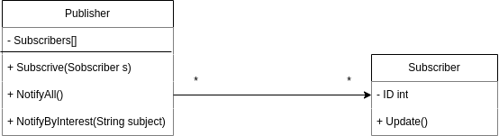

## Observer Pattern - Conceito

Também conhecido como Publish Subscribe, o observer pattern consiste em estabelecer um padrão de comunicação entre objetos, de maneira que um objeto esteja ciente de alterações em outro objeto. Uma outra maneira de explicar, seria olhar para o observer como uma relação um pra muitos, onde um objeto notifica para todos os seus dependentes que ele sofreu uma mudança. Redes sociais são um bom exemplo de aplicação, onde os usuários podem demostrar interesse em algum conteudo, e quando a fonte desse conteudo sofrer alguma alteração (Novas postagens), os usuarios interessados serão notificados.

## Que problema o observer resolve

Imagine que um cliente precise ficar visitando a loja para saber se determinado produto esta disponivel, isso geraria muitas viajens desnecessarias. Por outro lado se a loja notificar todos os clientes, sempre que um novo produto chegar, muitos deles não vao gostar de receber emails que não tem relevância pra eles. Sendo assim, o Observer
Pattern tem o objetivo de enviar atualizações apenas para objetos que se inscreveram como interessados.

## UML



## Quando usar

O observer (PPublish, Subscribe) é muito util uma parte do sistema emite informações que podem ser de interesse para outras partes do sistema. Nesse casso, quem emite a mensagem, faz isso uma unica vez, independente de quantos interessados existem, enquanto isso, cada parte so sistema pode se inscrever pra receber o conteudo emitido.

## Vantagens

**Desacoplamento:** O sujeito (subject) e os observadores (observers) são fracamente acoplados. O sujeito não precisa saber detalhes sobre os observadores além de que eles implementam uma interface comum. Isso facilita a manutenção e expansão do sistema, já que novos observadores podem ser adicionados sem alterar o sujeito.

**Atualizações automáticas:** Observadores recebem notificações automáticas quando o estado do sujeito muda, eliminando a necessidade de consultas manuais (polling).

**Escalabilidade:** Permite adicionar múltiplos observadores sem modificar o sujeito. Isso é útil em sistemas que precisam notificar diversas partes interessadas.

**Reutilização:** O padrão permite que os observadores sejam reutilizados em diferentes contextos, desde que implementem a interface adequada.

## Desvantagens

**Complexidade adicional:** A implementação do padrão pode adicionar complexidade ao código, especialmente em sistemas menores onde a simplicidade seria mais desejável.

**Impacto no desempenho:** Se houver muitos observadores ou notificações frequentes, pode haver impacto no desempenho do sistema devido ao excesso de atualizações.

**Risco de vazamento de memória:** Se os observadores não forem removidos corretamente do sujeito ao serem destruídos, podem ocorrer vazamentos de memória (em linguagens como C++ ou Python, onde o garbage collector não gerencia automaticamente referências circulares).

**Dependências ocultas:** O padrão pode introduzir dependências implícitas entre os objetos, tornando o sistema mais difícil de entender e modificar.

## Como executar o exemplo

Dependencias `go version go1.23.3`

No terminal:

```bash
# Entre no diretorio com o codigo fonte
$ cd src

# Execute o programa
$ go run main.go
```

## Referencias

-   [Canal Codigo Fonte](https://www.youtube.com/watch?v=ioYkXh8NhKc)
-   [Refactoring Guru](https://refactoring.guru/design-patterns/observer)
-   [GO Example](https://refactoring.guru/design-patterns/observer/go/example)
